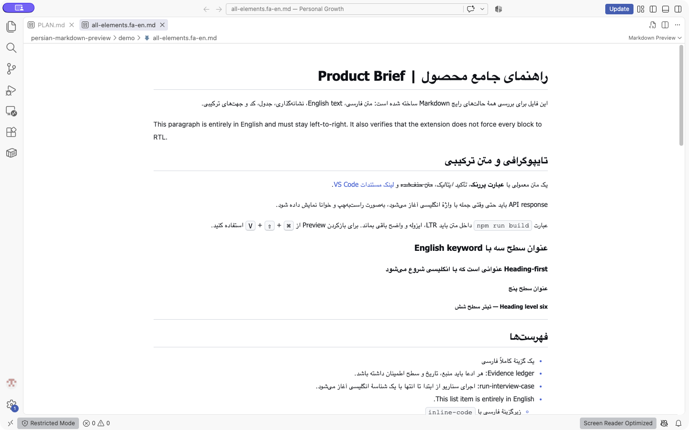
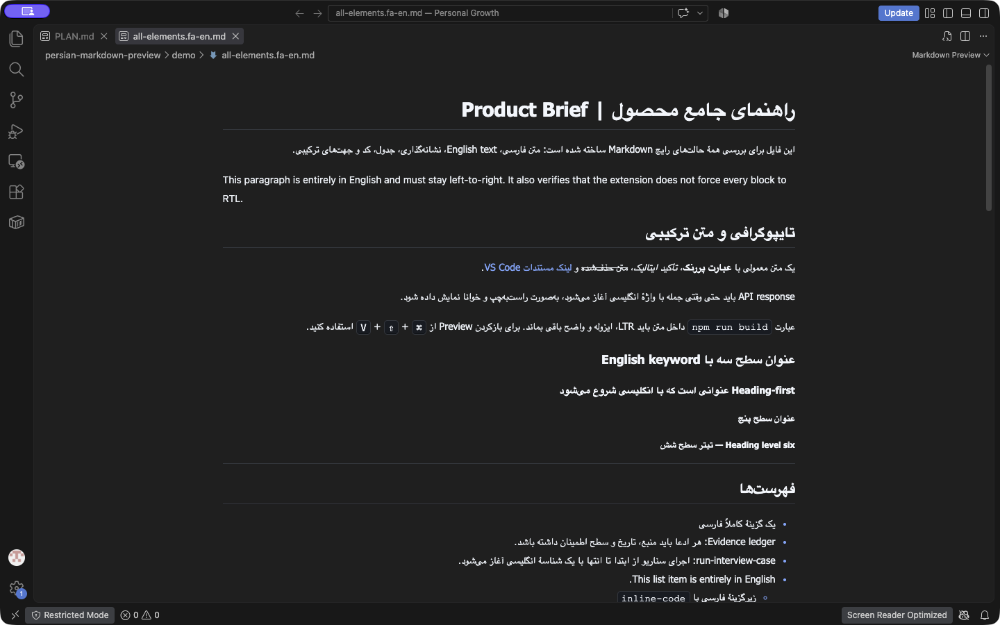

<p align="center">
  
</p>

<h1 align="center">Persian RTL Markdown Preview</h1>

<p align="center">
  Correct Persian/Farsi RTL and mixed English–Persian text in VS Code's built-in Markdown Preview.
</p>

<p align="center">
  <a href="https://github.com/sinatabar/vscode-persian-rtl-markdown-preview/actions/workflows/ci.yml"></a>
  <a href="https://github.com/sinatabar/vscode-persian-rtl-markdown-preview/releases/latest"></a>
  <a href="LICENSE"></a>
</p>

## فارسی

این افزونه نمایش داخلی Markdown در VS Code را برای متن فارسی، راست‌به‌چپ و محتوای ترکیبی فارسی–انگلیسی اصلاح می‌کند؛ بدون ویرایش فایل‌های اصلی VS Code و بدون ساختن یک ویرایشگر جداگانه.

حتی اگر یک سطر با واژه یا شناسهٔ انگلیسی شروع شود، وجود متن فارسی باعث می‌شود کل همان بلوک راست‌به‌چپ و خوانا نمایش داده شود:

```md
API response باید حتی وقتی جمله با واژهٔ انگلیسی آغاز می‌شود، خوانا باشد.
```

کدهای inline و code blockها چپ‌به‌راست باقی می‌مانند و پاراگراف‌های کاملاً انگلیسی نیز LTR نمایش داده می‌شوند.

## Preview

| Light | Dark |
| --- | --- |
|  |  |

## Features

- Per-block RTL/LTR detection for paragraphs, headings, lists, blockquotes and table cells.
- Correct RTL layout when a mixed sentence begins with English text.
- LTR isolation for inline code and fenced code blocks.
- Theme-aware colors for light, dark and high-contrast themes.
- Prefers Noto Sans Arabic/Noto Sans, with safe system-font fallbacks.
- Uses VS Code's official Markdown extension API; no core patching.
- No settings, telemetry, runtime dependencies or network requests.
- Works in Restricted Mode.

## Install

### From a VSIX file

1. Download the `.vsix` file from the [latest GitHub release](https://github.com/sinatabar/vscode-persian-rtl-markdown-preview/releases/latest).
2. In VS Code, open **Extensions**.
3. Open the `…` menu and select **Install from VSIX…**.
4. Reload the VS Code window when prompted.

### Use

Open any `.md` file and run **Markdown: Open Preview**. The shortcut is `⌘⇧V` on macOS and `Ctrl+Shift+V` on Windows/Linux.

> This extension changes the rendered preview only. The plain-text Markdown editor remains unchanged.

## How it works

The extension inspects each rendered Markdown block. A block containing Persian or Arabic-script characters receives an explicit RTL direction; English-only blocks remain LTR. Code is always isolated as LTR. Styling is added through VS Code's supported `markdown.previewStyles` and Markdown-it extension points.

## Development

```sh
npm install
npm test
npm run package
```

The package command creates a distributable `.vsix` file.

## Contributing

Bug reports and pull requests are welcome. Please read [CONTRIBUTING.md](CONTRIBUTING.md) before contributing. For security issues, follow [SECURITY.md](SECURITY.md).

## License

MIT © [Sina Tabar](https://github.com/sinatabar)
