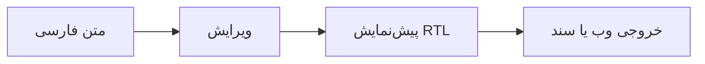

# نوشتن فارسی، ساده و دقیق

ویرایش و پیش‌نمایش Markdown فارسی با پشتیبانی درست از متن دوزبانه، فرمول و نمودار.

## امکانات اصلی

- [x] تشخیص خودکار جهت هر بند
- [x] ویرایش، پیش‌نمایش و حالت دوبخشی
- [x] پشتیبانی از زیرنویس و ابزارهای نگارشی فارسی

## فرمول‌های خوانا

قضیهٔ فیثاغورس $a^2 + b^2 = c^2$ و یک کسر مستقل:

$$
\frac{x_1 + x_2}{2} = \bar{x}
$$

## نمودار Mermaid

متن انگلیسی، `inline code` و بلوک‌های کد همیشه چپ‌به‌راست باقی می‌مانند.
